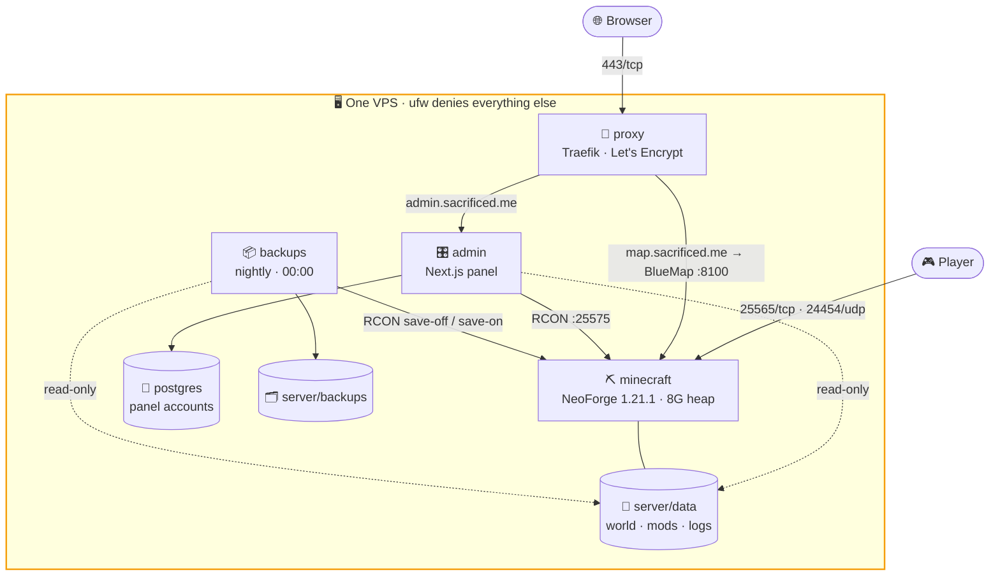

# ⛏️ Minecraft Server — NeoForge 1.21.1 on Docker

A production-oriented, single-command modded Minecraft server: NeoForge on
Minecraft 1.21.1, an 85-entry Create pack declared in a text file, scheduled world
backups, and a web control panel behind TLS — all reproducible from this
repository.

Built on [`itzg/minecraft-server`](https://github.com/itzg/docker-minecraft-server),
[`itzg/mc-backup`](https://github.com/itzg/docker-mc-backup), Next.js and Traefik.

| Service | Image | Role |
|---|---|---|
| `minecraft` | `itzg/minecraft-server:stable-java21` | the server |
| `backups` | `itzg/mc-backup:stable` | consistent world snapshots over RCON |
| `admin` | built from `admin/` | Server Admin Panel: charts, whitelist, console |
| `postgres` | `postgres:18-alpine` | panel user accounts |
| `proxy` | `traefik:v3.7` | TLS and routing (opt-in profile) |

| Host | Serves | Through Traefik? |
|---|---|---|
| `server.sacrificed.me` | the game on 25565/tcp, voice chat on 24454/udp | no — raw, DNS only |
| `admin.sacrificed.me` | Server Admin Panel | yes |
| `map.sacrificed.me` | BlueMap web map | yes |



Only three things answer from the internet: the game port, the voice-chat port
and Traefik. RCON, the panel and the map are bound to `127.0.0.1` and reachable
only through the proxy or an SSH tunnel.

### 📚 Documentation

| | |
|---|---|
| **This file** | requirements, quick start, configuration, the mod pack, everyday commands |
| [docs/deployment.md](docs/deployment.md) | DNS, Ansible, the CI pipeline, OVHcloud, security |
| [docs/operations.md](docs/operations.md) | the map, pre-generation, backups, updating, troubleshooting |
| [docs/admin.md](docs/admin.md) | operating the admin panel and its accounts |
| [admin/README.md](admin/README.md) | how the panel is built |
| [ansible/README.md](ansible/README.md) | how the playbook is organised |

---

## 📋 Requirements

| | Minimum | Comfortable |
|---|---|---|
| CPU | 2 cores | 4+ cores — the main tick is single-threaded, so clock speed beats core count; extra cores go to worldgen and mods |
| RAM | 6 GB | 12 GB |
| Disk | 15 GB SSD | 40 GB SSD |
| Players | — | tuned here for ~5 concurrent, 10 slots |
| OS | any systemd Linux | Ubuntu 26.04 LTS (what this is deployed on) |
| Software | Docker Engine 24+ with the Compose plugin | |

Gameplay settings ship at the **vanilla `server.properties` defaults** —
survival, simulation distance 10, spawn protection 16 — with three deliberate
changes: `DIFFICULTY=hard`, `VIEW_DISTANCE` raised to 16, and `MAX_PLAYERS`
lowered to 10.

The whole thing is sized for a **small server: around 5 concurrent players on a
12 GB / 6-core host** (e.g. OVH VPS-3) running the Create pack described
below. That player count is what buys the generous view distance — 16 costs
+147% loaded chunks per player over vanilla.

If you trim the pack down to a handful of mods, drop the heap to `6G` and
`MEM_LIMIT` to `8G`; the extra RAM does more good as page cache than as an
oversized heap.

Two vanilla defaults are worth revisiting once you have a mod list — see
`ALLOW_FLIGHT` and `MAX_TICK_TIME` in [Configuration](#-configuration).

Install Docker on a fresh Ubuntu 26.04 VPS:

```bash
curl -fsSL https://get.docker.com | sh
sudo usermod -aG docker "$USER"   # log out and back in afterwards
```

---

## 🚀 Quick start

```bash
git clone <this-repo> minecraft-server && cd minecraft-server

make init          # .env with generated RCON, panel and session secrets
nano .env          # set EULA=TRUE, OPS=<your-nickname>, ADMIN_HOST, ACME_EMAIL
make up            # start the server, backups and admin panel
make logs          # watch the boot
make proxy         # optional: Traefik for TLS on the admin panel
```

The **first boot takes 5–15 minutes**: it downloads the NeoForge installer, runs
it, fetches the mods, and generates the world. Later starts take under a minute.
The server is ready when the log shows `Done (…)! For help, type "help"`.

Connect from the game client at `<server-ip>:25565`.

> Your client needs the **same NeoForge build and the same mods** as the server.
> Read the build off the boot log, or run `make cmd C="neoforge mods"`.

Without `make`:

```bash
cp .env.example .env && nano .env
docker compose up -d
docker compose logs -f minecraft
```

---

## ⚙️ Configuration

Everything is driven by `.env` — `compose.yaml` should rarely need edits. See
[`.env.example`](.env.example) for the annotated list. The settings that matter
most:

| Variable | Default | Notes |
|---|---|---|
| `EULA` | `FALSE` | Must be `TRUE`. You are accepting the [Minecraft EULA](https://www.minecraft.net/eula). |
| `MC_VERSION` | `1.21.1` | Changing it on an existing world upgrades or corrupts it — back up first. |
| `NEOFORGE_VERSION` | *(empty)* | Empty = latest stable for `MC_VERSION`. **Pin it** once your mods work. |
| `MAX_MEMORY` | `8G` | JVM heap. Keep `INIT_MEMORY` equal to it (Aikar's flags assume a fixed heap) and `MEM_LIMIT` ~25% above. |
| `VIEW_DISTANCE` | `16` | Raised from the vanilla `10`. The biggest single lever on server load — drop to `10`–`12` if TPS suffers or you raise `MAX_PLAYERS`. |
| `MAX_PLAYERS` | `10` | Lowered from the vanilla `20`; headroom over the expected ~5 concurrent players. |
| `DIFFICULTY` | `hard` | Raised from the vanilla `easy`. Server-wide — Minecraft has no per-player difficulty. |
| `ALLOW_FLIGHT` | `FALSE` | Vanilla default. **Set to `TRUE` if any mod grants flight** (jetpacks, wings) — otherwise those players get kicked. |
| `ONLINE_MODE` | `FALSE` | Unlicensed clients can join. See the note below before changing it. |
| `MAX_TICK_TIME` | `60000` | Vanilla watchdog. Set to `-1` if a heavy pack trips it during worldgen. |
| `OPS` | *(empty)* | Comma-separated admin nicknames. |
| `WHITELIST` | *(empty)* | Comma-separated. Also set `ENFORCE_WHITELIST=true`. |
| `RCON_PASSWORD` | *(generated)* | Required. `make init` fills it in. |

> **This server runs with `ONLINE_MODE=FALSE`,** so a Minecraft licence is not
> required to join. The cost is that the server cannot verify who anyone is:
> a name is all a client presents. That makes the whitelist a list of *names*
> rather than accounts — anyone who learns a whitelisted name can join as that
> player, operators included.
>
> Keep `ENFORCE_WHITELIST=TRUE`, treat operator names as private, and remember
> that switching this value changes every player's UUID: whitelist and op
> entries have to be added again afterwards, and existing player data is
> orphaned. Set it once, before people start playing.

Changed something? `make restart` re-applies `.env` to the **Minecraft**
container. Settings the other services read — backups, the panel — need
`make up`, which reconciles every service against `compose.yaml`.

Anything without a variable can be edited directly in `server/data/server.properties`.
Note that `OVERRIDE_SERVER_PROPERTIES=true` re-applies the variables above on
every start, so for *those* keys you must edit `.env`, not the file.

> **Vanilla parity.** The generated `server/data/server.properties` was diffed against
> the file produced by the official Mojang 1.21.1 server jar: all 61 keys match,
> except `enable-rcon=true` and `rcon.password` (required by the backup sidecar
> and `make cmd`), plus `difficulty`, `view-distance` and `max-players` as tuned
> in `.env`.
>
> The file only holds 18 keys until the server finishes its first boot; Minecraft
> fills in the remaining defaults itself on load. Don't judge it mid-startup.

---

## 🧩 The mod pack

This is a **Create-focused pack**: Create 6 plus every NeoForge addon of it past
800k downloads, performance mods, and a client-side set for rendering, interface
and multiplayer — **85 entries** in [`server/mods.txt`](server/mods.txt), which
resolve to rather more jars once dependencies are pulled in.

**Every player needs the same mods and the same NeoForge build.** Almost all of
these add blocks and items, so a client without them cannot join.

Two lists feed the player pack:

| File | Installed on the server? | Why |
|---|---|---|
| [`server/mods.txt`](server/mods.txt) | yes | the pack is copied from the jars the server resolved |
| [`server/client-mods.txt`](server/client-mods.txt) | **no** | `make modpack` fetches these from Modrinth straight into the pack |

The second list exists for one reason. Most client-side mods sit harmlessly on a
dedicated server, so listing them in `mods.txt` is the shortest route to a
player. `sodium` is not one of them: it registers a `GraphicsBootstrapper` that
NeoForge runs during bootstrap, before any client-side check, and the server dies
with `NoClassDefFoundError: org/lwjgl/Version`. `iris` and `sodium-extra` require
sodium, so all three live in `client-mods.txt`.

`create-bits-n-bobs` is gone entirely: no build of it works with the current
`create-tfmg` and Create 6 at once, and tfmg has more downloads.

> **Simple Voice Chat uses its own port.** It listens on **UDP 24454**, which
> `compose.yaml` publishes and the `firewall` role opens. Change it with
> `VOICE_PORT` in `.env` — and in the mod's own config, which is written to
> `server/data/config/voicechat/voicechat-server.properties` on first boot.

### Managing mods

[`server/mods.txt`](server/mods.txt) is the single source of truth. Every mod
comes from Modrinth — there is no manual jar directory and no CurseForge
fallback, which keeps the pack fully reproducible from this repository.

Add the project slug, one per line, then `make restart`. The slug is the last
part of the project URL — `modrinth.com/mod/`**`create`**. Required dependencies
are resolved automatically. Removing a line removes the mod on the next restart.

Pin an exact build when you need reproducibility — the version ID comes from the
Modrinth version page URL:

```
create:6RGoOKrN
```

Two gotchas the current list already works around:

- **`:beta` is mandatory** where a project has no release build for 1.21.1.
  The resolver only considers releases, so `create-goggles` and
  `create-railways-navigator` would silently fail to install without it.
- **Dependency resolution follows the same rule.** `create-railways-navigator`
  needs `dragonlib`, which is beta-only — so `dragonlib:beta` has to be listed
  explicitly, or the server crashes at boot with a missing-dependency error.

Keep comments on their own lines; a trailing `#` on a slug line is not stripped.

> **If you ever need a mod that is not on Modrinth**, re-add the bind mount
> `- ./mods:/mods:ro` and `COPY_MODS_SRC: "/mods"` to `compose.yaml`, then drop
> the jar in `./mods/`. Note the asymmetry that made it worth removing: adding a
> jar there is automatic, but deleting one is not — the copy already made in
> `/data/mods` inside the container has to be removed by hand.

### Giving players the mods

Players need the same jars the server runs. `make modpack` collects them into
`server/modpack/`, skipping the server-only tools listed in
[`server/server-only-mods.txt`](server/server-only-mods.txt) — spark, chunky and
BlueMap do nothing in a client.

```bash
make modpack     # → server/modpack/modpack.zip
```

The panel serves it from the **Mods** page, so players can be pointed at a
download link instead of a chat message full of Modrinth URLs. Rebuild it after
any change to `server/mods.txt`.

### Before you add anything

- The project must have a **NeoForge** build for your `MC_VERSION`. Fabric-only
  and Forge-only jars will not load.
- Check the project's **server side** on Modrinth. Client-only mods (Sodium,
  Iris, minimaps, shaders, and FPS mods like CreateBetterFps) do nothing here
  and can break the boot.
- A mod whose dependency is not on Modrinth cannot be used at all. Create
  Ultimine is the example: it requires FTB Ultimine, which is CurseForge-only.
- Add mods a few at a time. When the server refuses to start, the crash log in
  `server/data/crash-reports/` names the culprit — a wall of 40 new mods does not.

---

## 🛠️ Everyday operations

`make help` lists everything, grouped. The common ones:

```bash
make up            # start
make down          # stop (the world in ./server/data is kept)
make restart       # re-read .env and mods.txt
make rebuild       # rebuild local images and recreate every service
make logs          # follow the log
make status        # container state and health
make health        # wait until the admin panel reports healthy
make stats         # live CPU / RAM
make disk          # space used by world and backups
make players       # who is online
make tps           # server tick rate
make mods          # installed mod jars
make map           # BlueMap render status
make offline-ids   # rewrite whitelist/ops UUIDs for ONLINE_MODE=FALSE
```

`make up` and `make restart` refuse to run without a `.env` and warn when
`EULA` is not `TRUE`.

### Running commands

```bash
make cmd C="say Server restarting in 5 minutes"
make cmd C="op Steve"
make cmd C="whitelist add Alex"
make rcon          # interactive RCON prompt
make console       # full server console — detach with Ctrl-P Ctrl-Q
```

> In `make console`, **Ctrl-C stops the server.** Detach with Ctrl-P Ctrl-Q.
> `make rcon` is the safer default.

### Pre-generating the world

Worldgen is the most expensive thing a modded server does, and doing it while
players explore is what produces lag spikes. The bundled `chunky` mod does it up
front:

```bash
make pregen R=3000               # radius in BLOCKS around spawn, not chunks
make cmd C="chunky progress"     # check on it
```

Budget the disk first — about 15 KB per generated chunk, so `R=3000` is roughly
2 GB and `R=10000` roughly 22 GB, before backups. Cancelling takes two commands
(`chunky cancel`, then `chunky confirm`); a restart resumes rather than restarts.

---

## 📂 Layout

```
compose.yaml           # all five services
.env                   # your configuration            (git-ignored)
.env.example           # annotated template
Makefile               # every operation, including the ones CI runs
docs/                  # deployment, running it, the admin panel
server/
  mods.txt             # what the server installs
  client-mods.txt      # fetched into the player pack, never onto the server
  server-only-mods.txt # installed, but withheld from the player pack
  bluemap/             # BlueMap config, mounted read-only over the defaults
  chunky/              # pre-generation config, same pattern
  shaders.txt          # what the Looks page offers
  resourcepacks.txt    #   "        "        "        "
  data/                # world, mod configs, logs      (git-ignored)
  backups/             # world archives                (git-ignored)
  modpack/             # built player modpack          (git-ignored)
admin/                 # Server Admin Panel (Next.js)
  README.md            # how the panel is built
  src/lib/             # RCON client, sessions, users, metrics, polling
  src/components/      # shell, charts, toasts, theme
  src/app/api/         # auth, metrics, users, whitelist, console, modpack
ansible/
  README.md            # layout, variable scheme, conventions
  site.yml             # the play: five roles, in order
  group_vars/all/      # shared values, plus the encrypted host password
  roles/               # common, hardening, docker, firewall, minecraft
  inventory.yml        # the host and its hostnames
.github/workflows/
  deploy.yml           # manual deployment pipeline
```

There is no Traefik config file: the proxy is configured entirely through flags
in `compose.yaml`, and its certificates live in a named volume.
