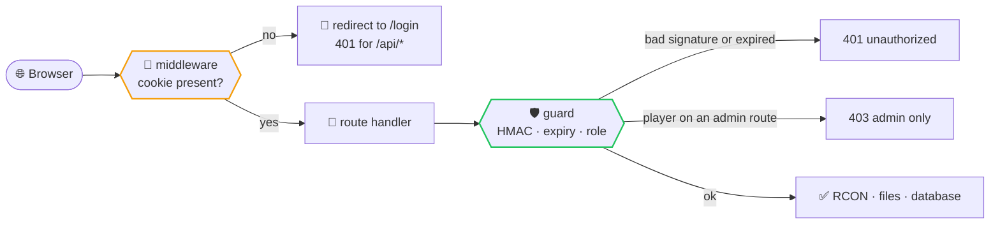
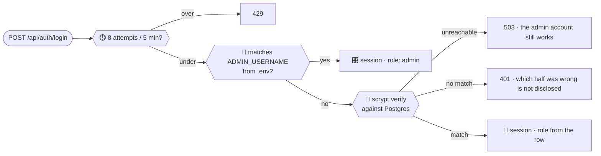

# 🎛️ Server Admin Panel

The Next.js admin panel for the Minecraft server. Built and run by the
`compose.yaml` in the repository root — see the [main README](../README.md) for
deployment.

---

## 📂 Layout

```
src/
  middleware.ts        # cheap gate: is a session cookie present?
  lib/                 # everything that is not a component
    session.ts         # stateless signed cookie, env-admin fallback
    guard.ts           # the real check: signature, expiry, role
    users.ts           # scrypt hashing, accounts
    db.ts              # Postgres pool and schema bootstrap
    rcon.ts            # Source RCON client
    mc.ts              # server status, whitelist, command parsing
    files.ts           # read-only views over /mcdata and /backups
    modrinth.ts        # titles, icons and downloads for the declared lists
    docker.ts          # container CPU/memory, through socket-proxy
    history.ts         # in-memory 30-minute metrics window
    api.ts             # response shapes shared by routes and pages
    route.ts           # withUser / withAdmin / json — one guard, one header
    polling.ts         # usePolled — the one way pages fetch
    format.ts          # bytes, durations, relative time
  app/api/             # auth, me, metrics, server, users, whitelist,
                       # console, logs, mods, modpack, extras, backups
  app/(dash)/          # the nine pages
  components/          # shell, charts, tiles, toasts, theme
```

Three rules keep this from drifting:

- **Pages never hand-roll a fetch.** `usePolled` owns no-caching, cleanup on
  unmount, keeping the last good value when a request fails, and redirecting to
  `/login` on a 401. The one exception is the Players page, which has to re-read
  three sources after every mutation and is commented as such.
- **A response shape is declared once**, in `lib/api.ts`, and the handler
  annotates its payload with it. Renaming a field on the server then fails to
  compile on the client instead of quietly rendering `—`.
- **Route handlers never repeat the guard.** `withUser` and `withAdmin` in
  `lib/route.ts` wrap every handler, and `json` sets `cache-control: no-store`
  in one place. A handler that forgets either is not possible to write.

---

## 🔌 How it talks to the server

| Need | Mechanism | Why |
|---|---|---|
| Players, TPS, commands | RCON to `minecraft:25575` | live server state |
| Whitelist / ops listing | reads `whitelist.json` / `ops.json` from `/mcdata` | structured and authoritative; parsing `/whitelist list` would lose UUIDs |
| Whitelist changes, offline mode | writes `whitelist.json`, then RCON `whitelist reload` | the server derives ids from a lower-cased name and writes ones no client presents |
| Whitelist changes, online mode | RCON `whitelist add/remove` | Mojang owns the ids, so the server must resolve them |
| Accounts | Postgres over the internal network | never published outside the compose network |
| CPU / memory | Docker Engine API through `socket-proxy`, reads only | optional; the UI hides those readings when it is absent |

Every mount into the container is **read-only** with one deliberate exception:
`server/data/whitelist.json`, which the panel owns while the server runs in
offline mode. Nothing else in the world directory is writable from here, and the
Docker socket is not mounted at all — `socket-proxy` answers reads instead.

`src/lib/rcon.ts` implements the RCON protocol directly rather than pulling in a
dependency — it is four fields wide, and multi-packet replies need explicit
reassembly with a sentinel packet.

---

## 🔐 Sessions and roles

Two layers, and only the second one is a security boundary:



The middleware runs on the edge runtime, where `node:crypto` is unavailable — so
it only checks that a cookie *exists*. Forging one gets you past it and no
further: every route handler re-verifies the signature through `lib/guard.ts`.
Hiding admin nav items in the UI is convenience, not enforcement.

Sign-in checks the `.env` admin **before** the database, so a Postgres outage
never locks the operator out of their own server:



The cookie is stateless: `base64url(payload).base64url(HMAC-SHA256)`, 12 hours,
with the role inside the payload. No session store can drift out of sync with
the database, at the cost of a role change only taking effect on the next
sign-in. Revoking a session early means rotating `SESSION_SECRET`.

---

## 💻 Local development

The panel needs a reachable server. Point it at one over SSH port-forwarding or
a local stack:

```bash
export RCON_HOST=127.0.0.1 RCON_PORT=25575 RCON_PASSWORD=... \
       ADMIN_USERNAME=admin ADMIN_PASSWORD=dev \
       SESSION_SECRET=0123456789abcdef0123456789abcdef \
       MC_DATA_DIR=../server/data
npm run dev
```

`DATABASE_URL` is optional here: without it the account pages report the database
as unavailable, and the `.env` admin above still signs in.

Without a server the dashboard still renders and reports the server as
unreachable, which is the state worth designing against anyway.

---

## 📊 Charts

One poller serves the whole app. `MetricsProvider` fetches `/api/metrics` every
5 s; the route reads a snapshot from `lib/history.ts`, which keeps a 30-minute
window in memory and collects on its own interval. Navigating between pages
never restarts the charts or doubles the RCON traffic against the server.

Nothing is persisted: a restart losing an hour of samples is cheaper than owning
a time-series database. Long-term profiling is `spark`'s job, in game.

`src/components/charts/LineChart.tsx` is hand-rolled SVG. Gridlines snap to
round steps (1, 2 or 5 × 10ⁿ) so a narrow range cannot print the same label
five times, and the axis takes its own formatter, separate from the tooltip's. The series colours in
`globals.css` come from a palette validated for colour-vision deficiency against
both glass surfaces; do not hand-tune them without re-validating.

Memory is a meter rather than a time series on purpose: Aikar's flags include
`AlwaysPreTouch`, so the whole heap is committed at startup and a memory line
chart would be flat forever.
