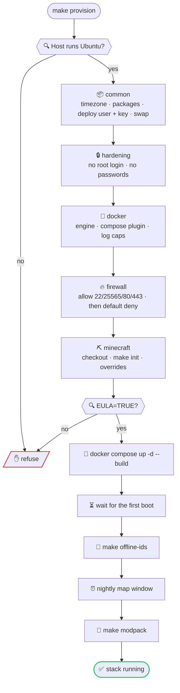
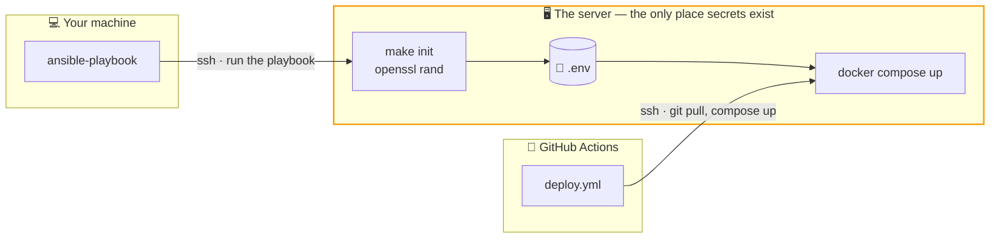

# 🏗️ Provisioning

Ansible takes a fresh Ubuntu host to a running stack. This file covers **how the
code is organised**; the [main README](../README.md) covers running a deployment.

```bash
make host-key           # 🔑 trust the host key, once
make provision-lint     # 🔍 syntax only — no host, no vault
make provision-check    # 🩺 dry run against the host, with a diff
make provision          # 🚀 apply
```

Ansible itself is optional: [`scripts/ansible.sh`](../scripts/ansible.sh) uses a
local `ansible-playbook` when there is one and a container when there is not,
which is what makes any of this work on Windows. The SSH key comes from
`.ssh/minecraft.key` in the checkout — git-ignored — or `~/.ssh/minecraft.key`;
`KEY=…` overrides both.

---

## 📂 Layout

```
ansible.cfg            # roles path, output format, SSH multiplexing
inventory.yml          # the host: address, login account, its hostnames
group_vars/all/
  main.yml             # values more than one role reads
  vault.yml            # the host password, encrypted
.vault-pass            # the key to it — never committed
site.yml               # the play: five roles, in order
roles/
  common/              # timezone, packages, deploy user, swap, file limits
  hardening/           # SSH policy
  docker/              # Engine and Compose plugin, daemon log caps
  firewall/            # ufw
  minecraft/
    checkout.yml       # the checkout and its .env
    stack.yml          # docker compose up
    post.yml           # offline ids, cron, modpack — needs a running server
```

---

## 🧩 Roles

Each owns one thing and carries one tag.

| Role | Tag | Owns |
|---|---|---|
| 📦 `common` | `common` | the host baseline and the account everything runs as |
| 🔒 `hardening` | `hardening` | who may log in over SSH, and how |
| 🐳 `docker` | `docker` | the container runtime |
| 🔥 `firewall` | `firewall` | which ports answer from outside |
| ⛏️ `minecraft` | `deploy` | the checkout, `.env` and the running stack |

Run one on its own with `--tags`, e.g.
`ansible-playbook site.yml --tags firewall`. Each role assumes the earlier ones
have run at least once.



### ⚠️ Three orderings are load-bearing

They are not cosmetic — reversing any one of them breaks the run:

1. **`common` installs the deploy user's key before `hardening` disables password
   authentication.** The other way round locks the playbook out of the host
   mid-play, with no way back in.
2. **`firewall` allows every port before it sets the default deny policy.** The
   other way round drops the SSH session the playbook is running over.
3. **`docker` flushes its restart handler before `minecraft` runs.** Handlers
   fire at the end of a play by default, so a new `daemon.json` restarted the
   daemon *after* the stack had been started — killing the server that had just
   finished a fifteen-minute first boot.

The same reasoning is why the EULA gate refuses rather than defaults: accepting
Mojang's licence is a decision for a person, not for automation.

---

## 🔑 Secrets never leave the host

The playbook runs `make init` **on the server**, which generates the RCON, admin,
session and Postgres secrets there and writes them into `.env`.



Notice what is missing: **no arrow points back out of the server.** Nothing reads
`.env` back, so the passwords are not in this repository, not in CI logs, and not
on the machine running the playbook. To see the panel password you have to be on
the host: `make admin-password`.

What travels inwards is non-secret — hostnames, `OPS`, `EULA` — through
`minecraft_env_overrides` in the inventory. The one exception is the host's own
sudo password, which is encrypted; see below.

---

## 🔐 The vault

One secret does have to travel *inwards*: the host account's own password, which
sudo asks for. It lives encrypted in `group_vars/all/vault.yml` and is committed;
the password that opens it lives in `ansible/.vault-pass` and never is.

```bash
make vault-edit     # 🔐 open it in $EDITOR, re-encrypt on save
make vault-rekey    # 🔑 change the password it is locked with
```

| | |
|---|---|
| 🔒 In the repository | `group_vars/all/vault.yml` — AES256, useless on its own |
| 🚫 Never in the repository | `.vault-pass` — keep it in your password manager |

Losing `.vault-pass` costs nothing but a rekey: the value inside is the provider's
console password, which you can reset there. Every other secret is still
generated on the server and never written down anywhere.

`ansible.cfg` deliberately does **not** name a `vault_password_file`. Pointing at
a file that is not in the repository would make `make provision-lint` fail on a
fresh checkout, so the targets that actually connect pass the flag themselves —
and lint keeps working with no secrets at all, including in CI.

---

## 🗂️ Variables

One name, one place:

| Where | What belongs there | Examples |
|---|---|---|
| `group_vars/all/main.yml` | anything more than one role reads | `timezone`, `deploy_user`, `deploy_path` |
| `roles/<name>/defaults/main.yml` | everything else, prefixed with the role name | `common_swap_gb`, `firewall_open_ports` |
| `inventory.yml` | only what is specific to this host | `ansible_host`, `minecraft_env_overrides` |

The prefix is the point. `deploy_user` used to be declared in both `group_vars`
and `roles/common/defaults`, and the two drifted — a rename in one place left the
other behind. A prefixed name makes it obvious which file it belongs in, and
shared names now exist exactly once.

---

## ✍️ Conventions

- **Task names** read `<emoji> <Verb> | <what>`, one emoji per verb:

  | | | | |
  |---|---|---|---|
  | 🔍 Check | 📦 Setup | ⚙️ Config | 🔒 Harden |
  | 🚀 Deploy | 🎁 Build | ♻️ Restart | 📊 Report |

- **Every file opens with one comment** saying what it owns — no more.
- **Inline comments are a single line** and explain *why*. The task name already
  says what.
- **Nothing secret in plain YAML.** `main.yml` may reference `vault_*` names;
  the values live only in `vault.yml`.
- **Only `ansible.builtin`**, so nothing has to come from Galaxy before the
  playbook will run. Where that costs a raw `command`, the task pairs it with an
  explicit `changed_when` so the run still reports honestly.
- **Every task is idempotent** — a second run reports no changes. Some commands
  make that harder than it looks: `ufw default` and `ufw enable` print success
  whether or not they changed anything, so the firewall role reads
  `ufw status verbose` once and acts only on the difference.
