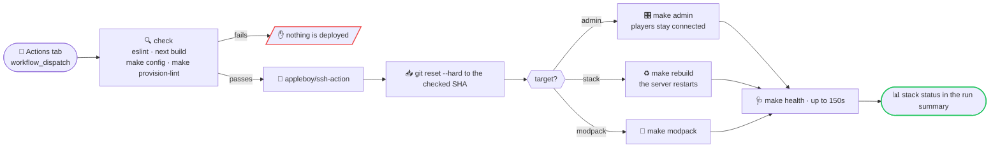

# 📤 Deployment

Taking this stack from a fresh VPS to a running server, and keeping it there.
See the [main README](../README.md) for what it is and how to run it.


---

## 🌐 DNS

Three A records, all pointing at the VPS:

```
server.sacrificed.me   A   <vps-ip>
admin.sacrificed.me    A   <vps-ip>
map.sacrificed.me      A   <vps-ip>
```

Only the last two go through Traefik. Minecraft speaks its own TCP protocol on
25565, so `server.sacrificed.me` needs nothing but the record — players type it
straight into the client.

> Point the records at the host **before** `make proxy`. Let's Encrypt validates
> over HTTP, so a name that does not resolve yet fails the challenge, and
> repeated failures hit rate limits.

---

## 🏗️ Provisioning with Ansible

[`ansible/`](../ansible/) takes a fresh Ubuntu 26.04 host to a running stack. Every
task is idempotent, and only `ansible.builtin` modules are used, so nothing has
to be installed from Galaxy first.

```bash
make provision-lint               # syntax only, no host needed
make provision-check              # dry run against the host, shows the diff
make provision                    # apply
```

[`ansible/inventory.yml`](../ansible/inventory.yml) is committed and already
points at `server.sacrificed.me`. Nothing in it is secret — the hostnames are
public DNS records, the repository is public, and every password is generated
on the server by `make init`. Edit it directly to target a different host.

> Running from a Codespace prints *"world writable directory ... ignoring it as
> an ansible.cfg source"*. Harmless: the playbook finds its roles relative to
> `site.yml` either way, and it does not happen on a normal checkout.

Five roles, each with its own defaults, run in order:

| Role | Tag | What it does |
|---|---|---|
| `common` | `common` | timezone, packages, unattended upgrades, deploy user, swap, file limits |
| `hardening` | `hardening` | SSH drop-in: no root login, no passwords, `MaxAuthTries` |
| `docker` | `docker` | Docker CE from upstream plus the Compose plugin, daemon log caps |
| `firewall` | `firewall` | ufw: SSH, 25565/tcp, 24454/udp, 80, 443, default deny inbound |
| `minecraft` | `deploy` | clone, `make init`, apply `minecraft_env_overrides`, start the stack, install the map crontab, build the modpack |

Run one on its own with `--tags`, e.g.
`ansible-playbook -i inventory.yml site.yml --tags firewall`. Roles assume the
earlier ones have run at least once — `firewall` needs ufw from `common`,
`minecraft` needs Docker.

Shared values live in [`ansible/group_vars/all/main.yml`](../ansible/group_vars/all/main.yml),
everything else in `roles/*/defaults/main.yml` under the role's own prefix, and
the inventory carries only what differs for your host.
[`ansible/README.md`](../ansible/README.md) covers the layout and conventions.

Two deliberate choices:

- **Secrets are generated on the host.** The playbook runs `make init` there; the
  passwords never pass through Ansible, the repository or CI. Only non-secret
  values (hostnames, `OPS`, `MOTD`) come from `minecraft_env_overrides` in the
  inventory. The one secret going the other way — the host account's own password,
  which sudo asks for — is encrypted in `group_vars/all/vault.yml`; see
  [the vault section](../ansible/README.md#-the-vault).
- **The playbook refuses to start the server if `EULA` is not `TRUE`.** Accepting
  Mojang's licence is a decision for a person, not for automation. Set it in
  `minecraft_env_overrides` once you have read it.

---

### 🔐 Before the first run

The playbook needs the vault open. `ansible/.vault-pass` is never committed, so
on a fresh checkout you restore it from your password manager:

```bash
printf '%s' '<the vault password>' > ansible/.vault-pass
make provision
```

Without it `make provision` stops immediately and says which file is missing,
rather than failing part-way through a run. `make provision-lint` needs neither
the vault nor a host, which is why CI can run it on every push.

---

## 📤 The deployment pipeline

[`.github/workflows/deploy.yml`](../.github/workflows/deploy.yml) is
**manual only** (`workflow_dispatch`). A push never deploys: restarting the
server drops whoever is playing, and that should be somebody's decision.

Run it from the Actions tab and pick a target:

| Target | Effect |
|---|---|
| `admin` | rebuilds the panel with `--no-deps` — **players stay connected** |
| `stack` | recreates every service; the server restarts |
| `modpack` | rebuilds `modpack.zip` from the installed jars |

It lints and builds the panel and validates `compose.yaml` and the Ansible
playbook **before** touching the server, then applies and waits for the panel to
report healthy — failing the run with the last 50 log lines if it does not.

The server is reset to **the exact commit the checks passed on**, not to the
branch tip: those differ the moment somebody pushes while a deployment is
queued behind the `deploy` concurrency group.

**Every remote step is a `make` target** — `make admin`, `make rebuild`,
`make modpack`, `make health`, `make status`. Nothing the pipeline does exists
only in the workflow file, so when a deployment misbehaves you can ssh in and
run the identical command by hand. It also means `make`'s own `check`
prerequisite guards the pipeline: a missing `.env` stops the deployment.

The `check` job validates compose the same way, through `make init` and
`make config` rather than placeholder environment variables — so a change that
breaks `make init` on a fresh host fails in CI instead of on the server.



### Setting it up

Repository secrets:

| Secret | What |
|---|---|
| `SSH_HOST` | the server address |
| `SSH_USER` | the deploy user (`minecraft` by default) |
| `SSH_KEY` | a private key whose public half is in that user's `authorized_keys` |
| `SSH_PORT` | optional, defaults to 22 |

And a repository variable `DEPLOY_PATH` if the checkout is not at
`/opt/minecraft-server`.

#### Host key verification is off

SSH authenticates in both directions: the key proves who the runner is, the
host key proves the machine answering is really your server. A fresh CI runner
knows no host keys, and this workflow passes no `fingerprint` to
`appleboy/ssh-action` — so it connects to whatever answers on `SSH_HOST`.

This is a deliberate trade-off, so be clear about what it does and does not
cost. Authentication is by key, and an SSH public-key signature is bound to the
session: an impostor **cannot** replay it against the real server, and never
sees the private key. Your server is not the thing at risk.

What an impostor would get is the deployment: the script text it is sent
(`DEPLOY_PATH`, the branch, the commit — none of them secret) and the ability to
return fabricated output, so the run reports a healthy green deploy while the
real server received nothing. It becomes a bigger deal the day somebody passes
a real secret through `envs`.

To turn verification on, record the fingerprint **from a machine you already
trust**, store it as `SSH_FINGERPRINT`, and add one line to each remote step:

```bash
ssh-keyscan -t ed25519 server.sacrificed.me | ssh-keygen -lf -
#   -> 256 SHA256:hR3k…Qw server.sacrificed.me (ED25519)
```

```yaml
fingerprint: ${{ secrets.SSH_FINGERPRINT }}
```

It changes only if the server is rebuilt.

**CI never sees the server's secrets.** `.env` is created on the host by Ansible
and stays there; the pipeline only runs git and compose commands over SSH.

`make release` does the same deployment from your own machine, through Ansible,
if you would rather not go through GitHub.

---

## ♻️ Auto-start on the VPS

`restart: unless-stopped` brings the server back after a crash or a reboot,
provided the Docker daemon itself starts at boot:

```bash
sudo systemctl enable docker
```

---

## ☁️ Deploying on OVHcloud VPS

Notes specific to an OVH VPS (written against **VPS-3**: 6 vCore, 12 GB RAM,
100 GB NVMe, 2 Gbps, anti-DDoS included — the size the defaults target).

**1. Base setup.** Pick **Ubuntu 26.04 LTS** at install time and add your SSH key
in the OVH panel. Then harden the login:

```bash
sudo tee /etc/ssh/sshd_config.d/99-hardening.conf >/dev/null <<'EOF'
PermitRootLogin no
PasswordAuthentication no
EOF
sudo systemctl restart ssh
```

> Ubuntu 26.04 ships a drop-in directory and socket-activated SSH. Writing a
> drop-in survives package upgrades, which editing `sshd_config` in place does
> not.

**2. Firewall.** Open only SSH and the game port. Do this *before* the first
`make up` — `ufw enable` over SSH without allowing 22 first locks you out.

```bash
sudo ufw allow 22/tcp
sudo ufw allow 25565/tcp
sudo ufw allow 24454/udp
sudo ufw allow 80,443/tcp
sudo ufw enable
```

> Docker publishes ports by writing iptables rules that bypass ufw's `INPUT`
> chain, so a published port is reachable even when ufw claims to deny it. The
> compose file avoids the trap by binding RCON to `127.0.0.1` rather than
> relying on the firewall. For defence in depth, add a rule in the **OVH Network
> Firewall** (panel → the VPS → *IP* tab), which filters upstream of the host.

**3. Deploy.**

```bash
ssh ubuntu@<vps-ip>
curl -fsSL https://get.docker.com | sh
sudo usermod -aG docker "$USER" && exec su -l "$USER"

git clone <this-repo> minecraft-server && cd minecraft-server
make init && nano .env      # EULA=TRUE, OPS=<your-nick>
make up && make logs
```

**4. Disk budget.** Daily archives kept 3 days means at most 3 copies of the
world, plus the world itself and BlueMap's render. On 100 GB that is comfortable
even for a large modded world. Watch it with `make disk`.

**5. Watch the disk anyway.** `make disk` shows the world and archive sizes. If
they grow faster than expected, `PRUNE_BACKUPS_DAYS` is the lever.

**6. OVH's own backups are not a substitute.** The included daily snapshot is a
whole-disk image on OVH's side — good for "the VPS died", useless for "restore
yesterday's world after a bad mod update", and gone if the account is. Keep the
sidecar running and sync `server/backups/` off-host.

**7. Anti-DDoS is always on** and needs no configuration. It absorbs volumetric
floods; it does not stop application-level abuse, so keep the whitelist in mind
if the server is public.

---

## Security

The compose file publishes RCON on `127.0.0.1` only. An internet-exposed RCON
port hands a full remote console to anyone who guesses the password — keep
`RCON_BIND=127.0.0.1` unless there is a VPN in front of it.

Open only what players and Traefik need:

```bash
sudo ufw allow 25565/tcp        # game
sudo ufw allow 24454/udp        # voice chat
sudo ufw allow 80,443/tcp       # panel + Let's Encrypt challenge
sudo ufw enable
```

Keep `ONLINE_MODE=TRUE`. With it off, anyone can connect under any nickname —
including yours, and yours is an operator.

`.env` holds the RCON password, the admin password and the session secret. It\nis git-ignored; keep it that way.
